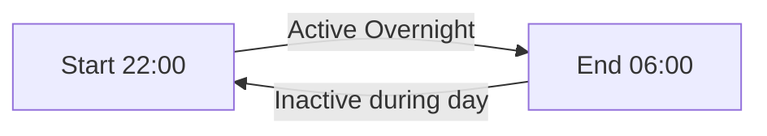

# Schedule Types

The scheduler supports multiple ways to define *when* something should happen.

## Event (Point in Time)
A single trigger at a specific time.
- **Example**: Turn on the lights at 18:00.
- **Output**: Sends a payload exactly at the configured time.

## Timespan (Duration)
A period with a defined **Start** and **End** time.
- **Example**: "Active" from 09:00 to 17:00.
- **Output**:
  - Sends a "Start" payload at the beginning.
  - Sends an "End" payload when the time is up.

### Wrap-Around Schedules
Timespans that cross midnight are fully supported.
- **Example**: 22:00 (10 PM) to 06:00 (6 AM).
- **Logic**: The scheduler understands this implies the duration spans into the next day.



---

## Solar Events

Trigger events based on the sun's position. Requires **Latitude** and **Longitude** in node settings.

| Event ID | Event | Description |
| :--- | :--- | :--- |
| `nightEnd` | Night End | Astronomical twilight starts (-18°) |
| `nauticalDawn` | Nautical Dawn | Nautical twilight starts (-12°) |
| `civilDawn` | Civil Dawn | Civil twilight and golden hour starts (-6°) |
| `sunrise` | Sunrise | Top edge of sun appears (-0.833°) |
| `sunriseEnd` | Sunrise End | Bottom edge of sun touches horizon (-0.3°) |
| `morningGoldenHourEnd` | Morning Golden Hour End | Sun is 6° above horizon |
| `solarNoon` | Solar Noon | Sun at highest position |
| `eveningGoldenHourStart` | Evening Golden Hour Start | Sun is 6° above horizon |
| `sunsetStart` | Sunset Start | Bottom edge of sun touches horizon (-0.3°) |
| `sunset` | Sunset | Sun disappears below horizon (-0.833°) |
| `civilDusk` | Civil Dusk | Civil twilight ends (-6°) |
| `nauticalDusk` | Nautical Dusk | Nautical twilight ends (-12°) |
| `nightStart` | Night Start | Astronomical twilight ends (-18°) |
| `nadir` | Nadir | Sun at lowest point (solar midnight) |

### Offsets
Apply +/- offsets to any solar event:
- **Example**: "Sunset + 30 mins" (30 minutes *after* sunset).
- **Example**: "Sunrise - 1 hour" (1 hour *before* sunrise).

---

## Cron Expressions

For complex, recurring patterns, use standard Cron syntax. The UI provides a **Cron Builder**.

### Format
```
* * * * * * *    Field              Allowed values    Special symbols
| | | | | | |    -----------------  ---------------   ---------------
`-|-|-|-|-|-|->  Second (optional)  0-59              * / , -
  `-|-|-|-|-|->  Minute             0-59              * / , -
    `-|-|-|-|->  Hour               0-23              * / , -
      `-|-|-|->  Day of Month       1-31              * / , - ? L W
        `-|-|->  Month              1-12 or JAN-DEC   * / , -
          `-|->  Day of Week        0-7 or SUN-SAT    * / , - ? L #
            `->  Year (optional)    1970-2099         * / , -
```

### Special Characters
| Symbol | Meaning |
| :--- | :--- |
| `*` | Matches all values (e.g., every minute). |
| `?` | No specific value (day-of-month or day-of-week). |
| `-` | Range (e.g., `10-12` = hours 10, 11, 12). |
| `,` | List (e.g., `MON,WED,FRI`). |
| `/` | Increment (e.g., `0/15` = 0, 15, 30, 45). |
| `L` | Last (e.g., `L` in day-of-month = last day; `6L` = last Friday). |
| `W` | Nearest weekday (e.g., `15W` = nearest weekday to the 15th). |
| `#` | Nth occurrence (e.g., `6#3` = third Friday of the month). |

### Examples
| Expression | Description |
| :--- | :--- |
| `* * * * * *` | Every second |
| `0 * * * * *` | Every minute |
| `0 */10 * * * *` | Every 10 minutes |
| `0 0 12 * * *` | Every day at noon |
| `0 0 7 * * MON#1 *` | At 07:00 on the first Monday of the month |
| `0 0 2 29 FEB * 2020/4` | At 02:00 on Feb 29 (leap years) |
| `0 12 * * MONL` | At 12:00 on the last Monday of the month |

---

## Date Sequences

You can also use fixed dates instead of cron expressions:
- Single date: `2024-12-25 08:00`
- Multiple dates: `2024-12-25 08:00, 2024-12-31 23:59`
- Timezones: `2024-01-01 00:00 GMT+2`
